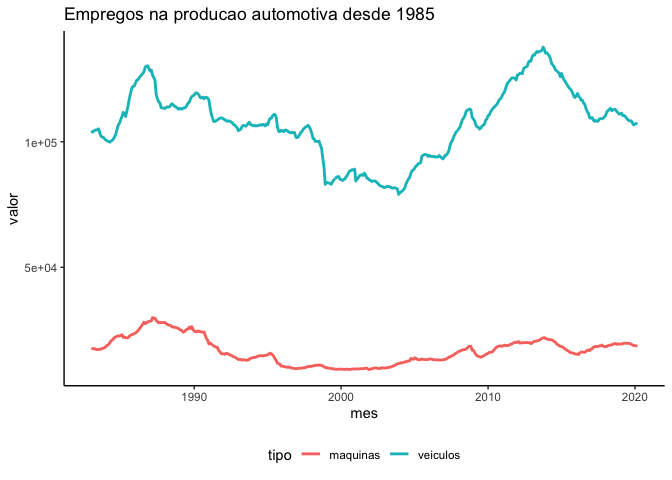
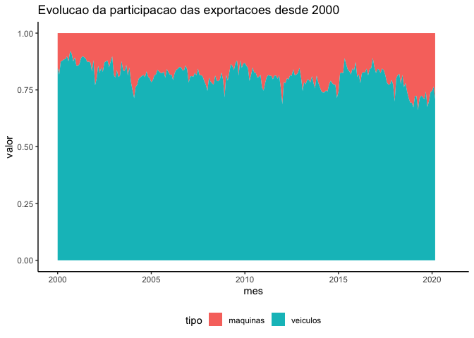

<!-- README.md is generated from README.Rmd. Please edit that file -->

# anfavea

<!-- [](https://www.tidyverse.org/lifecycle/#experimental) -->

Dados da [ANFAVEA](http://www.anfavea.com.br/) no `R`.

## Installation

``` r
devtools::install_github("tomasbarcellos/anfavea")
```

## Example

### Emprego

``` r
library(anfavea)
library(tidyverse)

theme_set(
  theme_classic() + 
    theme(legend.position = "bottom")
)

empregos %>% 
  filter(valor > 0) %>% 
  ggplot(aes(mes, valor, col = tipo)) +
  geom_line(size = 1) + 
  ggtitle("Empregos na producao automotiva desde 1985")
```



### Exportacoes

``` r
exportacoes %>% 
  filter(mes >= as.Date("2000-01-01"), tipo != "total") %>% 
  ggplot(aes(mes, valor, fill = tipo)) +
  geom_area(size = 1, stat = "identity", position = "fill") +
  ggtitle("Evolucao da participacao das exportacoes desde 2000")
```



### Licenciamento e producao

``` r
veiculos %>% 
  filter(valor > 0, mes >= as.Date("2000-01-01"), 
         variavel == "Licenciamento Importados") %>% 
  ggplot(aes(mes, valor, col = veiculo)) +
  geom_line(size = 1) +
  ggtitle("Evolucao do licenciamento de veiculos importados desde 2000")
```


### Maquinas

``` r
maquinas %>% 
  filter(valor > 0, mes >= as.Date("2000-01-01"), 
         variavel == "Produção", maquina != "TRATORES DE RODAS") %>% 
  ggplot(aes(mes, valor, col = maquina)) +
  geom_line(size = 1) +
  ggtitle("Evolucao da producao de maquinas desde 2000") + 
  guides(col = guide_legend(nrow = 2, byrow = TRUE))
```


